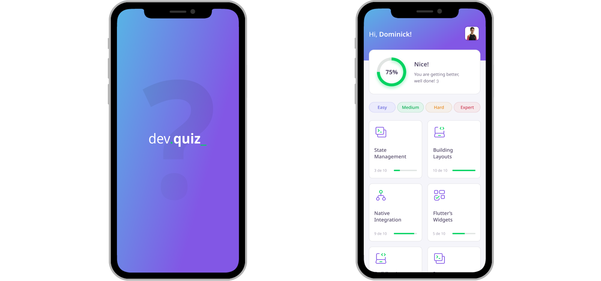

<h2 align="center">
  🔷 DevQuiz 🔷
</h2>

<br />

<p align="center">
  <a href="#-about">About</a>&nbsp;&nbsp;&nbsp;|&nbsp;&nbsp;&nbsp;
  <a href="#-layout">Layout</a>&nbsp;&nbsp;&nbsp;|&nbsp;&nbsp;&nbsp;
  <a href="#-how-to-run">How To Run</a>&nbsp;&nbsp;&nbsp;|&nbsp;&nbsp;&nbsp;
  <a href="#-license">License</a>
</p>

<br />

<p align="center">
  
</p>

## 📕 About

Quiz App developed using Flutter for study purposes. This project was promoted by Rocketseat during the Next Level Week #5.

## 🛠️ Layout

You can find the application UI design here: [Figma](https://www.figma.com/file/Kn4qyLRDE9WWlyJ3CAQrmp/DevQuiz---Dominick-Brasileiro)

## ℹ️ How To Run

You'll need [Flutter](https://flutter.dev) set up on your computer to build this app.

```bash
git clone https://github.com/dominickbrasileiro/devquiz.git
$ cd devquiz
$ flutter pub get
$ flutter run
```

Runs the app in the development mode.

## 📝 License

This project is under the MIT license. See the [LICENSE](https://github.com/dominickbrasileiro/devquiz/blob/main/LICENSE) for more information.

---

Made with ❤️ by Dominick Brasileiro 💎 [Get in touch!](https://www.linkedin.com/in/dominickbrasileiro/)

[](https://www.linkedin.com/in/dominickbrasileiro/)
[](mailto:brasileiro.dominick@gmail.com)